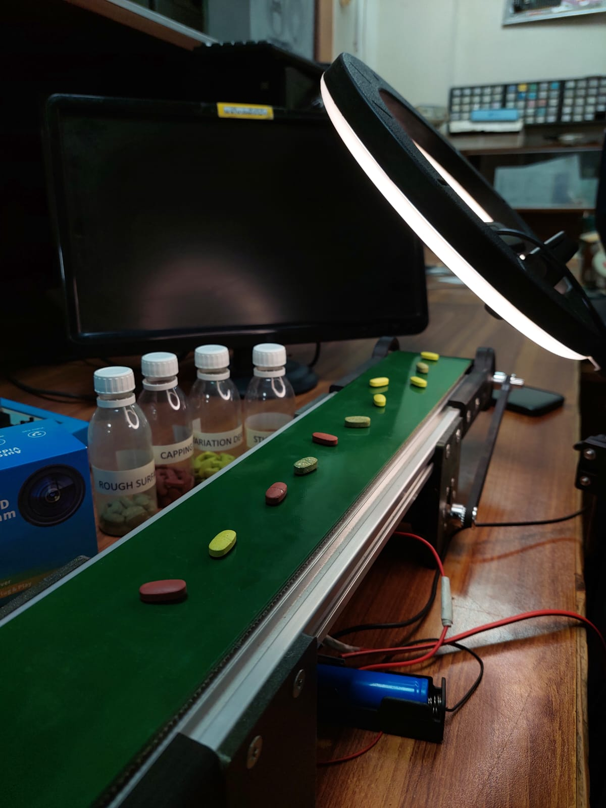
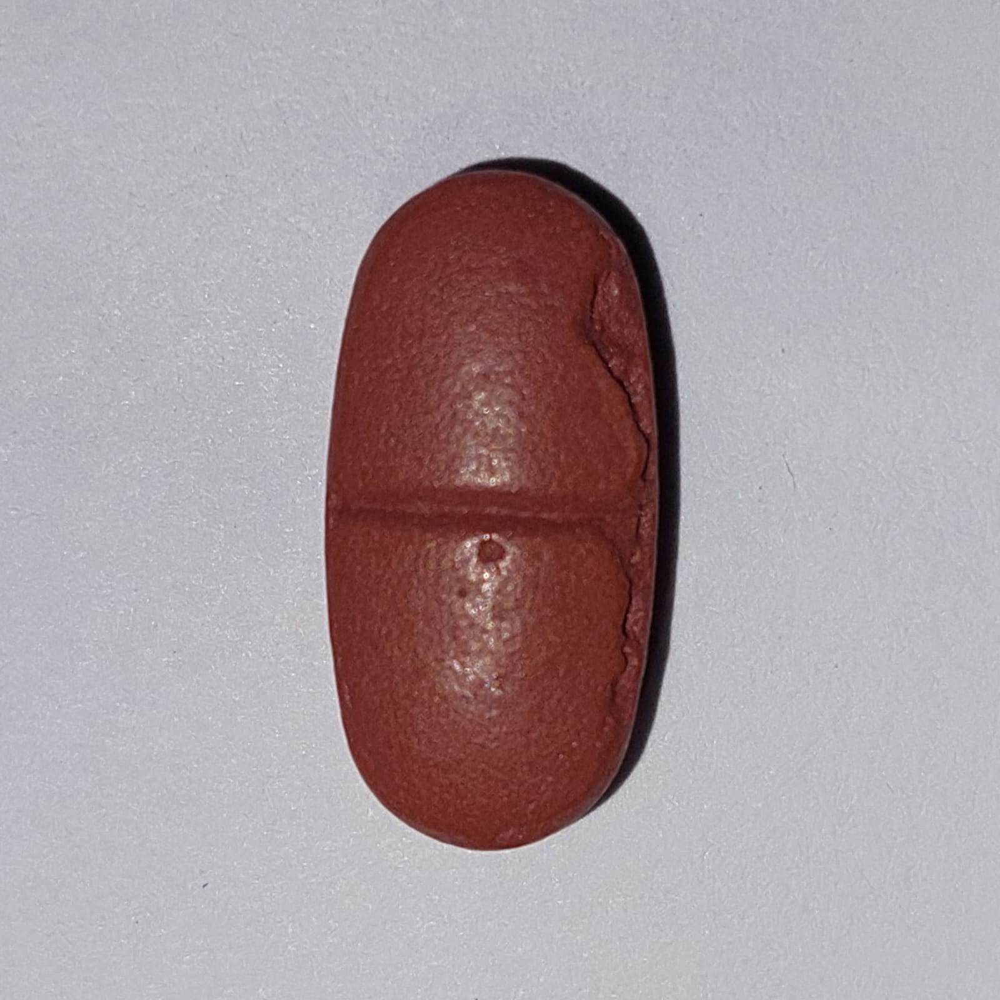
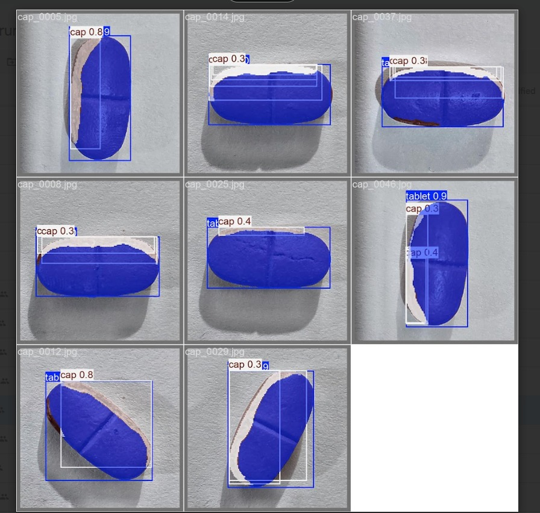
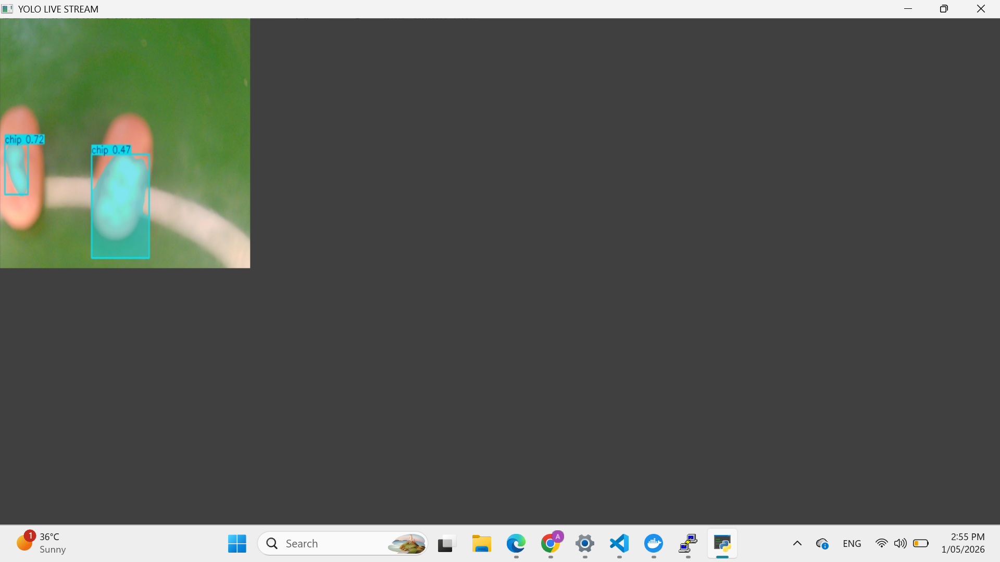
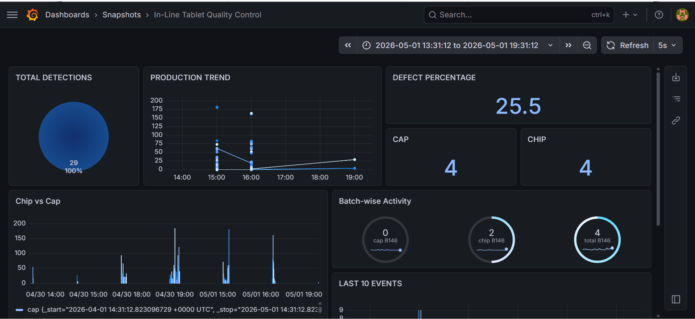
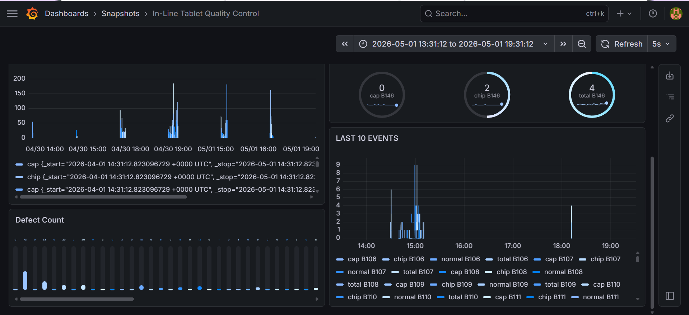

### In-Line Tablet Quality Control using Computer Vision | Real-Time Defect Detection Pipeline

## Abstract
Conventional pharmaceutical tablet quality control relies largely on off-line testing performed on limited samples, which is time-consuming, labor-intensive, and prone to missing critical defects. This limitation highlights the need for an automated in-line inspection approach capable of ensuring consistent product quality while minimizing waste.

This project presents an in-line tablet quality control system based on machine vision and deep learning for real-time inspection of tablet cores. The proposed system employs a conveyor-mounted imaging setup integrated with controlled illumination and a high-resolution RGB camera to capture detailed surface images of tablets under motion.

A custom dataset was developed using images collected across multiple orientations and lighting conditions to ensure robustness. Two common surface defect categories, namely edge chipping and capping, were annotated and used for model training and evaluation.

A YOLO-based deep learning model was trained and optimized to perform real-time defect detection, focusing on high accuracy, low latency, and industrial throughput. Additionally, a HMI dashboard was developed to provide live inspection statistics and quality reports, ensuring traceability and compliance with audit requirements.

By enabling early defect detection and intervention, the system improves patient safety, manufacturing efficiency, and reduces material wastage, contributing to a more sustainable production ecosystem.


## Sustainable Development Goals (SDGs)
<p align="left">    </p> 


Core Technologies:
<p align="left">         


## System Architecture:
```
Camera → Raspberry Pi → Image Processing (OpenCV)
           ↓
      YOLO Model (Inference)
           ↓
   Defect Detection Output
           ↓
   InfluxDB → Grafana Dashboard
```


## Features:
-Real-time tablet inspection \
-Detection of edge chipping and capping defects \
-Live dashboard for monitoring production quality \
-Scalable and containerized deployment using Docker 


## System Setup



## Sample Dataset Images

if you want dataset, kindly contact at anooshakhalid999@gmail.com


## Detection Results




## Demo Video
[Demo Video](videos/Demo.mp4)


## Dashboard Preview:




## Installation & Setup:
1️⃣ Clone Repository \
```git clone https://github.com/AnooshaKhalid/inline-tablet-vision-hmi.git ``` \
``` cd inline-tablet-vision-hmi ``` \
2️⃣ Setup Environment \
```pip install -r requirements.txt ``` \
3️⃣ Run with Docker \
```docker-compose up --build``` \
4️⃣ Start System \
```python pi_inference.py```


## License
This project is developed for academic purposes (FYDP).

## Acknowledgment
Special thanks to faculty, mentors, and contributors who supported this project. \
Computer Systems Engineering - CIS \
NED University of Engineering & Technology